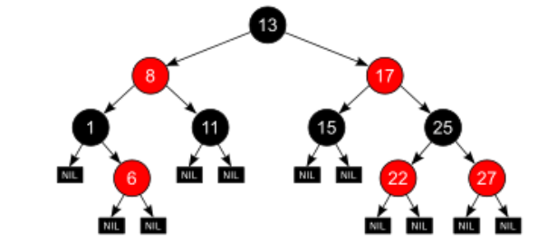

# TreeSet
TreeSet은 데이터를 정렬된 상태로 유지하고 중복을 허용하지 않고 관리할 수 있는 컬렉션 클래스이다.

TreeSet이 존재하기 이전 이와 같이 데이터를 중복을 허용하지 않고, 데이터를 정렬된 상태로 저장하려면 데이터 추가/삭제 시 마다 정렬 및 중복 제거를 하는 비효율적인 작업이 이루어져야 했다.  

그래서 정렬 및 중복 제거를 효율적으로 하기 위해 자바는 TreeSet이라는 컬렉션을 추가한 것이다.

## TreeSet 동작 원리
TreeSet의 내부를 보면 TreeMap을 통해 데이터를 관리한다.

```java
// TreeSet의 기본 생성자
public TreeSet() {
   this(new TreeMap<>());
}
```

TreeSet에 데이터를 추가하면, 실제로는 이 데이터가 TreeMap의 키(Key) 부분에 저장된다.

TreeMap의 값(Value) 부분에는 `PRESENT`라는 의미 없는 더미 객체가 저장된다.  
즉, TreeSet은 TreeMap을 이용하여 '값'은 버리고 '키'만을 사용하는 Wrapper 클래스라고 할 수 있다.

## TreeMap의 정렬
그러면 TreeMap은 어떻게 데이터를 정렬된 상태로 유지할까?  
바로 Red-Black Tree 라는 자가 균형 이진 탐색 트리 자료 구조를 사용하기 때문이다.

레드-블랙 트리는 이진 탐색 트리의 개선된 버전인데, 이진 탐색 트리의 기본적인 개념은 다음과 같다.
- 각 노드는 하나의 데이터를 가진다. 
- 왼쪽 자식 노드: 부모 노드의 데이터보다 항상 작다. 
- 오른쪽 자식 노드: 부모 노드의 데이터보다 항상 크다.

이러한 구조로 찾으려는 데이터를 빠르게 찾을 수 있다.  
예를 들어 50이라는 값을 찾는다면 루트 노드부터 시작해 50과 값을 비교해 왼쪽, 오른쪽으로 한 단계씩 내려가며 찾으려는 데이터를 찾을 수 있다.

하지만 이진 탐색 트리에도 단점이 있는데, 데이터가 순차적으로 입력될 경우 (예: 1, 2, 3, 4, 5 순서로 추가), 트리가 한쪽으로만 계속 길어지는 **편향 트리**가 된다.
이 경우, 데이터를 검색하는 것이 배열을 순차적으로 탐색하는 것과 다를 바 없이 비효율적이게 된다.

### 레드-블랙 트리 (Red-Black Tree)
레드-블랙 트리는 이러한 이진 탐색 트리의 편향 문제를 해결한, 스스로 균형을 맞추는 트리이다.  
레드-블랙 트리는 다음의 규칙을 통해 트리의 높이가 한쪽으로 치우치지 않고 거의 균형 잡힌 상태를 유지한다.

1. 모든 노드는 빨간색 또는 검은색이다.
2. 루트 노드는 항상 검은색이다.
3. 모든 리프 노드(자식이 없는 노드, 여기서는 null 노드를 의미)는 검은색이다.
4. 빨간색 노드의 자식은 반드시 검은색이다 (빨간색 노드가 연속으로 나타날 수 없음).
5. 임의의 노드에서부터 그 자손인 리프 노드까지 가는 모든 경로에는 동일한 개수의 검은색 노드가 존재한다.



TreeSet에 새로운 데이터가 추가되거나 기존 데이터가 삭제될 때마다, 이 규칙들이 깨질 수 있다.  
그러면 레드-블랙 트리는 Rotation과 Recoloring이라는 두 가지 작업을 통해 스스로 구조를 변경하여 위의 5가지 규칙을 다시 만족시키고 트리의 균형을 맞춘다.

이러한 자가 균형 조정 기능 덕분에 TreeSet은 데이터가 어떤 순서로 들어오든 상관없이 항상 최악의 경우에도 검색, 추가, 삭제 작업에서 `O(log N)`이라는 효율적인 시간 복잡도를 보장할 수 있다

## Set은 무엇을 기준으로 '동일하다'고 판단할까?
Set은 어떤 Set 구현체를 사용하느냐에 따라 동일성 판단 기준이 다르다.

### HashSet
HashSet은 해시를 사용하여 데이터를 관리한다.  
즉, HashSet도 내부에서는 HashMap을 이용해 데이터를 저장한다.(key에 데이터를 저장하고 value는 더미 데이터를 저장)  
그래서 hashCode()와 equals()를 이용해 데이터 중복 여부를 판단한다.

```java
// HashSet 생성 시 내부 코드
private transient HashMap<E, Object> map;

public HashSet() {
    map = new HashMap<>();
}
```

1. hashcode()로 저장하려는 객체의 해시값을 통해 내부에 동일한 해시값이 저장되어 있는지 확인한다.
2. 없다면 중복되지 않는 데이터로 판단하여 새로 저장하고 중복되는 데이터가 있다면 equals()로 진짜 같은지 확인한다.
3. 서로 다른 객체가 해시값이 같을 수 있기 때문에 hashcode() 값이 같으면 그 객체의 equals()를 통해 진짜 같은지 판단하고 true이면 데이터를 저장하지 않는다.

만약 a.equals(b)가 true라면, a.hashCode()와 b.hashCode()는 반드시 같아야 한다.  
만약 이 규칙이 꺠지면, equals()로는 동일한 객체인데 hashCode()가 달라 서로 다른 '버킷'에 저장되어 중복 데이터가 발생하는 문제가 생길 수 있다.

### TreeSet
TreeSet은 데이터를 정렬된 상태로 유지하기 때문에 TreeSet의 동일성 판단 기준은 해시 코드와는 전혀 관련이 없고, 오직 '정렬을 위한 비교' 결과에만 의존한다.

TreeSet에 새로운 데이터를 추가하려고 하면, TreeSet은 레드-블랙 트리의 적절한 위치를 찾기 위해 기존 노드들과 새 데이터를 비교한다.

이때 다음과 같은 두 가지 방법으로 비교를 한다.

#### Comparable 인터페이스의 compareTo() 메소드  
- 데이터 클래스가 Comparable 인터페이스를 구현했다면, TreeSet은 이 클래스가 가진 compareTo() 메소드를 사용하여 객체 간의 순서를 비교한다. 
- a.compareTo(b)의 결과는 세 가지 중 하나이다. 
  - 음수: a가 b보다 앞에 온다 (작다). 
  - 양수: a가 b보다 뒤에 온다 (크다). 
  - 0: a와 b는 정렬 순서상 동일하다.

#### Comparator 인터페이스의 compare() 메소드
- TreeSet을 생성할 때 Comparator라는 '비교 규칙'을 따로 지정해주었다면, TreeSet은 그 규칙의 compare() 메소드를 사용하여 비교한다. 
- compare(a, b)의 결과도 compareTo()와 마찬가지로 음수, 양수, 0으로 나온다.

TreeSet의 동일성 판단
TreeSet은 비교 과정에서 compareTo() 또는 compare() 메소드의 결과가 0이 나오면, 두 객체를 '동일한 데이터'라고 간주하고 데이터 추가를 하지 않는다.

즉, TreeSet에게 '동일함'의 판단 기준은 equals() 메소드가 true인지 false인지가 아니라 "정렬했을 때 같은 위치에 있어야 하는가?"로 판단한다.

### TreeSet의 동일성 판단은 비교 메서드를 어떻게 정의하기에 달려있다.
TreeSet에서 두 데이터가 '같다'는 것은, 개발자가 compareTo()나 compare() 메소드 안에 정의한 비교 로직에 따라 계산된 결과 값이 0이라는 의미이다.

예를 들어, "사람" 객체를 '나이'로만 정렬하는 TreeSet이 있다고 가정해 보자.  
이 TreeSet에는 이름이 "홍길동"이고 나이가 25살인 사람과, 이름이 "김철수"이고 나이가 25살인 사람이 동시에 존재할 수 없다.  
왜냐하면 compare() 메소드가 두 사람의 나이를 비교하고 '같다'고 판단하여 0을 반환할 것이고, TreeSet은 이를 '중복'으로 처리하기 때문이다.

### 언제 TreeSet을 사용해야 할까?
1. 데이터의 자동 정렬이 필요할 때
- 가장 핵심적인 사용 이유이다. 데이터를 추가하거나 삭제할 때마다 컬렉션이 항상 정렬된 상태를 유지해야 하는 경우 TreeSet을 선택하는 것이 최적이다. 
  - 예시: 사용자 목록을 항상 알파벳순으로 보여줘야 하는 경우, 숫자로 된 아이템 ID를 크기순으로 관리해야 할 때 
  - ArrayList에 데이터를 넣고 매번 Collections.sort()를 호출하는 것보다 훨씬 효율적이다.
2. 최솟값(Min) 또는 최댓값(Max)을 자주 찾아야 할 때
- 정렬되어 있으므로 가장 작은 값(first())과 가장 큰 값(last())을 찾는 연산이 `O(log N)`이 아닌 `O(1)`에 가깝게 매우 빠르다.
3. 범위 검색 또는 근사 값 찾기가 필요할 때
- TreeSet은 정렬된 상태를 활용한 탐색 메서드를 제공한다. HashSet이나 LinkedHashSet에는 없는 기능이다.
  - headSet(element): 지정된 요소보다 작은 값들의 집합 반환
  - subSet(from, to): 두 요소 사이의 값들의 집합 반환
  - ceiling(element): 지정된 값보다 크거나 같은 값 중 가장 작은 값 반환
  - floor(element): 지정된 값보다 작거나 같은 값 중 가장 큰 값 반환

## 결론
- 순서는 상관없고 속도가 가장 중요하다면? → HashSet
- 입력한 순서가 중요하다면? → LinkedHashSet
- 항상 정렬된 상태를 유지하고, 특정 범위의 데이터를 자주 검색한다면? → TreeSet
